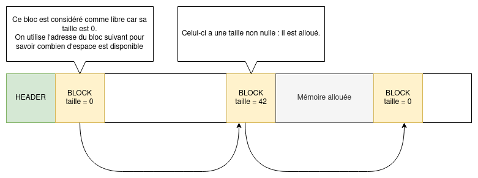
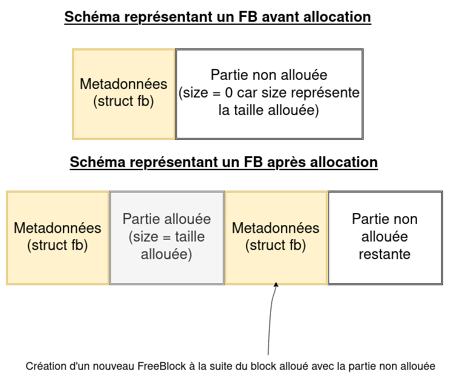
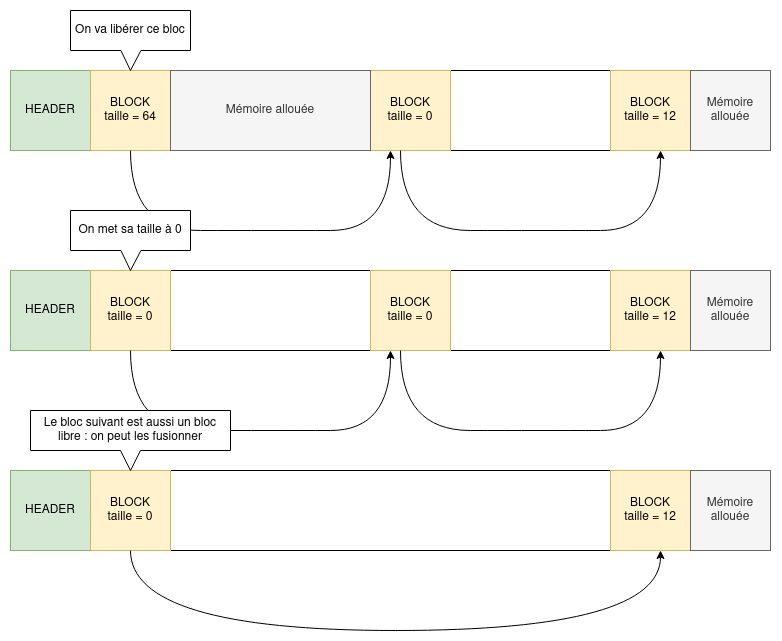
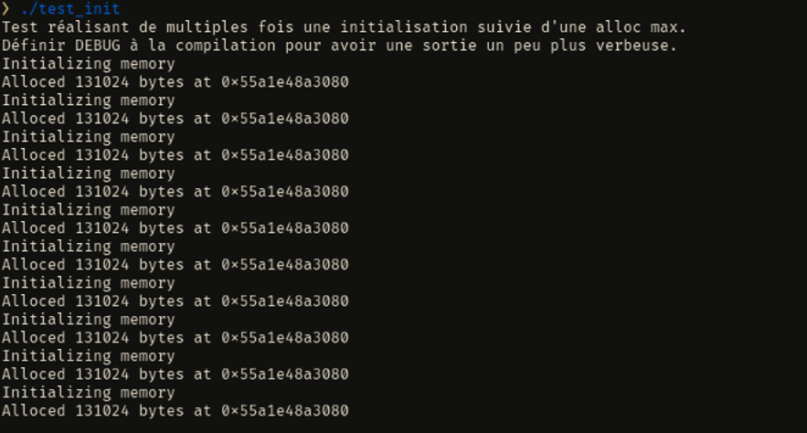
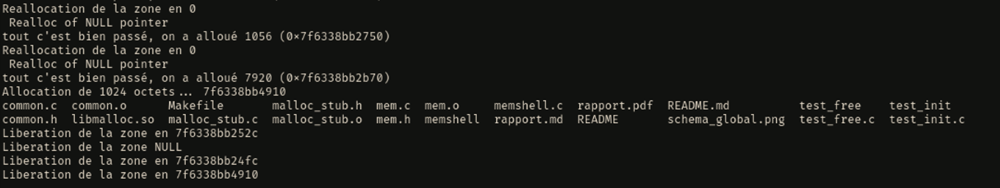

# Présentation et Objectifs du TP

L'objectif du TP est de créer un allocateur mémoire fonctionnel, permettant d'initialiser une zone mémoire, d'afficher tous les blocks mémoires alloués, ainsi que d'allouer et de libérer de la mémoire. 

# Mise en place des expériences

Avant de commencer à coder, nous avons commencé par réfléchir à notre implémentation, notamment à l'aide de schémas. Notre implémentation fonctionne de la façon suivante : les blocs mémoires sont représentés par la structure fb (pour freeblock), cette structure dispose de deux champ :
- Une variable de type size_t appelée "size", correspondant à la taille de la partie occupée du bloc.
- Un pointeur vers le freeblock suivante. Ils forment donc une liste chaînée.

La variable size contient la taille de la zone mémoire allouée pour ce bloc. Elle est égale à zéro si jamais le bloc n'est pas alloué.

L'allocateur comporte plusieurs fonctions :

`mem_init`, qui sert à instancier la zone mémoire ainsi que le premier freeblock. Ce premier bloc a une taille de zéro : toute la mémoire est considérée comme libre.

`mem_show`, qui permet d'afficher la liste de freeblock instanciés.

`mem_alloc`, qui cherche parmi la liste de freeblock une zone qui a encore assez d'espace libre. Si le champ `next` de ce bloc est vide c'est qu'on est à la fin de la liste des blocs. On définit alors la taille du dernier bloc comme étant la taille de la zone demandée, et on ajoute un nouveau bloc après cette zone, contenant la fin de la mémoire libre. Si on est pas en bout de chaîne, on ajoute un freeblock intermédiaire si on a la place, pour séparer la zone libre entre une zone nouvellement allouée, et
une zone qui reste libre.

`mem_free`, qui cherche la zone mémoire entrée en paramètre, récupère le freeblock qui s'y trouve et met sa taille à 0. Si le bloc suivant le bloc libéré n'est pas alloué, il est fusionné avec le bloc libéré.

Pour tester notre application, nous nous sommes principalement servi des tests fournis avec les fichiers de code, à savoir ceux inclus dans `test_init.c` et dans `test_ls`. Nous avons également crée un fichier `test_free.c`, dans lequel nous testons l'allocation et la libération de mémoire.

# Présentation des résultats

Le `test_init` et le `test_ls` fournis fonctionnent tout deux avec notre allocateur, comme vous pouvez le constater avec les images ci-dessous.

# Conclusion

Au vu des résultats obtenus avec les tests fournis, nous pouvons donc affirmer que notre allocateur mémoire est fonctionnel. Nous n'avons pas réalisé d'extensions.
